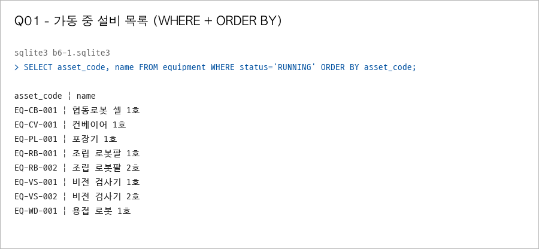
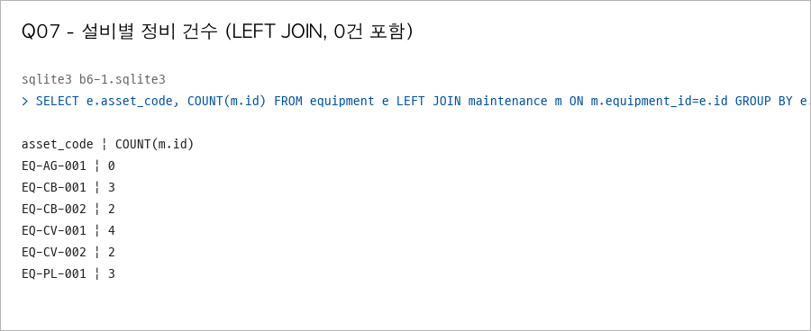
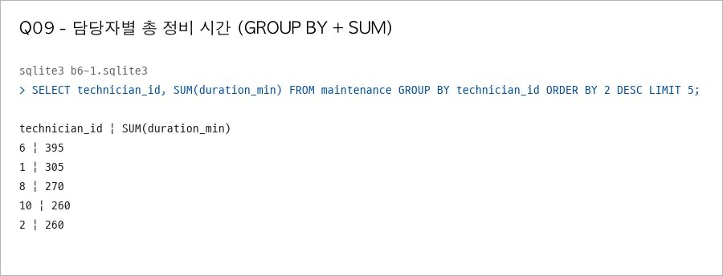
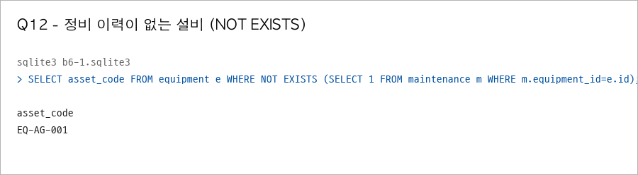
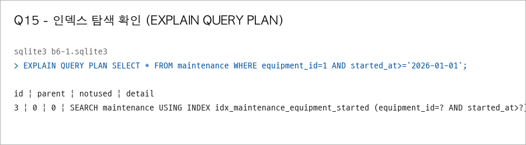

# B6-1 정보를 깔끔하게 정리하는 디지털 서랍장 만들기

코딧세이 AI 올인원 본과정 B6-1 미션 저장소입니다.

## 소재
스마트팩토리·로봇을 소재로 삼는다. 설비 카탈로그와 정비 이력을 담는 서랍장을 만든다. 설비·부품·정비 기록의 관계를 다룬다.

## 범위
SQL 실습·테이블 4개+·1:N 관계 2개+·CREATE/INSERT 스크립트·쿼리 15개·인덱스

## 개발 환경
SQLite와 `sqlite3` CLI를 사용한다. 백엔드 프레임워크는 쓰지 않는다.

### 새 환경에서 준비

Git을 설치한 뒤 새 기기에서 저장소를 받습니다.

```bash
git clone https://github.com/sarguments/b6-1-sql-drawer.git
cd b6-1-sql-drawer
```

SQLite 명령줄 도구를 설치한 뒤, 저장소 루트에서 메모리 데이터베이스 연결을 확인합니다.

```bash
sqlite3 --version
sqlite3 :memory: "SELECT sqlite_version();"
```

## 파일 구성

| 파일 | 내용 |
| --- | --- |
| [`schema.sql`](schema.sql) | 테이블 5개 생성(`CREATE TABLE`) — PK·FK·제약조건·타입 주석 |
| [`seed.sql`](seed.sql) | 샘플 데이터 입력(`INSERT`) — 테이블당 10행 이상 |
| [`queries.sql`](queries.sql) | 핵심 쿼리 15개 + 각 쿼리 한 줄 설명 + 인덱스 |
| [`QUERIES.md`](QUERIES.md) | 쿼리 15개를 한 쿼리마다 설명·SQL 전문·실행 결과 전체로 정리한 문서 |
| [`results/`](results) | 쿼리별 실행 결과 텍스트(`Q01`~`Q15`)·요약·보너스 3건 |
| [`erd.svg`](erd.svg) · [`erd.dot`](erd.dot) | 테이블 관계도(ERD) 이미지와 생성 원본 |
| [`scripts/capture_results.py`](scripts/capture_results.py) | 스키마·샘플 데이터를 새로 채우고 결과를 다시 만드는 스크립트 |

## 실행 방법

결과를 다시 만들려면 스키마·샘플 데이터부터 새 데이터베이스에 채워야 합니다. `queries.sql` 뒤쪽에 값을 바꾸는 `UPDATE`·`DELETE`가 있어서, 이미 바뀐 데이터에 다시 실행하면 결과가 달라지기 때문입니다.

```bash
python3 scripts/capture_results.py      # 결과 일괄 재생성 (권장)
```

손으로 한 단계씩 확인하려면 같은 일을 이렇게 합니다.

```bash
rm -f b6-1.sqlite3
sqlite3 b6-1.sqlite3 < schema.sql
sqlite3 b6-1.sqlite3 < seed.sql
sqlite3 b6-1.sqlite3 < queries.sql
```

`queries.sql`은 표준 SQL 범위로 썼습니다. SQLite 고유 문법을 쓴 곳은 두 군데뿐이고, 해당 위치에 주석으로 표시했습니다.

- `schema.sql`의 `AUTOINCREMENT`(자동 증가 키), `PRAGMA foreign_keys = ON`(외래 키 검사 켜기)
- `queries.sql` Q15의 `EXPLAIN QUERY PLAN`(실행 계획 출력)

## 데이터 설계

- 테이블 5개: `equipment`(설비), `technician`(정비 담당), `component`(부품), `maintenance`(정비 이력), `alarm_log`(알람 로그).
- 1:N 관계 4개: 설비→부품, 설비→정비 이력, 담당자→정비 이력, 설비→알람 로그.
- 제약조건: `asset_code`·`employee_no`에 `UNIQUE`, 주요 컬럼에 `NOT NULL`, `status`·`cert_level`·`kind`·`result`에 `CHECK`(정해진 값만 저장), 부품 수량 `CHECK (quantity > 0)`.
- 타입: 날짜만 필요하면 `DATE`, 시각까지 필요하면 `DATETIME`, 값·식별자는 `TEXT`, 개수·시간은 `INTEGER`. 근거는 각 컬럼 옆 주석에 적었다.
- 외래 키: `schema.sql` 첫 줄의 `PRAGMA foreign_keys = ON`이 있어야 실제로 막힌다(SQLite 기본값은 꺼짐). 확인 결과는 `results/bonus2-fk-violation.txt`에 있다.
- 인덱스 1개: `idx_maintenance_equipment_started` — `maintenance (equipment_id, started_at)`. 설비 하나의 기간별 정비 이력 조회가 가장 잦아, 설비로 먼저 좁히고 그 안에서 기간을 자르게 했다. 이유와 전후 실행 계획은 `queries.sql`의 Q15에 있다.

## 엑셀·파일 대신 데이터베이스를 쓴 이유

같은 표를 엑셀 파일로도 만들 수 있다. 그래도 여기서는 테이블로 나눠 저장했고, 그 차이는 아래 지점에서 드러난다.

- **관계를 값으로 잇는다**: 엑셀에서 정비 이력에 설비 이름을 적으면 이름이 바뀔 때 그 시트를 전부 고쳐야 한다. 여기서는 `maintenance`가 설비의 `id`만 갖고(`equipment_id`) 이름은 `equipment` 한 행에만 있다. 이름을 한 번 고치면 연결된 조회가 모두 새 이름으로 나온다.
- **무결성을 저장 시점에 막는다**: 엑셀은 없는 설비 번호를 적어도 아무 일도 일어나지 않는다. 여기서는 `PRAGMA foreign_keys = ON`이 켜져 있어 없는 부모를 가리키는 입력이 거부된다(`results/bonus2-fk-violation.txt`).
- **규칙을 스키마가 강제한다**: `NOT NULL`·`UNIQUE`·`CHECK`로 값의 누락·중복·범위를 저장 단계에서 막는다(`asset_code` 중복 불가, `status`는 정해진 값만). 엑셀의 유효성 검사는 셀 단위 수식이라 복사·붙여넣기로 우회된다.
- **여러 사람이 동시에 다룰 수 있다**: 공유 파일은 두 사람이 열면 나중에 저장한 쪽이 앞선 저장을 덮는다. 데이터베이스는 여러 연결이 동시에 읽고 쓰고, 트랜잭션으로 일부만 반영되는 상태를 막는다.
- **필요한 열만 골라 한 번에 뽑는다**: 조인·집계로 원하는 조합을 쿼리 하나로 얻는다(Q05~Q11). 엑셀의 VLOOKUP·피벗도 비슷한 일을 하지만, 데이터가 늘면 시트 전체를 다시 계산해야 한다.

## 핵심 개념 정리

- **PK vs FK**: PK(Primary Key)는 그 행 하나를 가리키는 고유 이름표다. `equipment.id`처럼 행마다 다르고 비어 있을 수 없다. FK(Foreign Key)는 다른 표의 PK를 가리키는 연결 고리다. `maintenance.equipment_id`가 `equipment.id`를 가리키는 식이다. PK는 "이 행은 누구인가", FK는 "이 행은 누구와 이어져 있나"를 담당한다.
- **1:N 관계**: 한 부모 행에 여러 자식 행이 붙는 관계다. 설비 한 대에 정비 이력이 여러 건 붙는 것이 그 예다. 자식 쪽(`maintenance`)이 부모의 id(`equipment_id`)를 값으로 들고 있어, 이 값으로 둘을 이어 붙인다.
- **INNER JOIN vs LEFT JOIN**: `INNER JOIN`은 양쪽에 짝이 있는 행만 남긴다. `LEFT JOIN`은 왼쪽 표의 행을 모두 남기고, 오른쪽에 짝이 없으면 그 자리를 `NULL`로 채운다. Q07에서 정비 이력이 없는 설비(`EQ-AG-001`)를 0건으로 남기는 데 `LEFT JOIN`을 썼다.
- **GROUP BY와 집계 함수**: `GROUP BY`로 행을 기준별로 묶고, 묶음마다 `COUNT`(건수)·`SUM`(합계)·`AVG`(평균)를 계산한다. Q09는 담당자별로 묶어 총 정비 시간을, Q10은 설비별로 묶어 평균·최대 시간을 구한다. 묶은 뒤의 조건은 `WHERE`가 아니라 `HAVING`으로 건다(Q10의 `HAVING COUNT(m.id) >= 2`).
- **SELECT / INSERT / UPDATE / DELETE**: `SELECT`는 조회, `INSERT`는 새 행 입력, `UPDATE`는 기존 값 변경, `DELETE`는 행 삭제다. 데이터를 바꾸는 쿼리(Q13·Q14)는 조회(Q01~Q12) 뒤에 둔다.
- **인덱스**: 특정 컬럼 기준으로 찾을 때 표 전체를 훑지 않도록 미리 정렬해 둔 색인이다. 자주 조건으로 쓰는 컬럼에 붙인다. Q15는 `maintenance (equipment_id, started_at)`에 붙여, 실행 계획이 전체 훑기(`SCAN`)에서 인덱스 탐색(`SEARCH ... USING INDEX`)으로 바뀌는 것을 보여준다.

## 쿼리 15개

> [!TIP]
> 쿼리별 한 줄 설명·SQL 전문·실행 결과 전체는 **[`QUERIES.md`](QUERIES.md)** 에 모아 두었다.

쿼리 본문은 [`queries.sql`](queries.sql)에, 각 쿼리의 실행 결과는 `results/`의 `Q01.txt`~`Q15.txt`에 있다.

- 기본 조회: [Q01](results/Q01.txt) · [Q02](results/Q02.txt) · [Q03](results/Q03.txt) · [Q04](results/Q04.txt)
- 조인: [Q05](results/Q05.txt) · [Q06](results/Q06.txt) · [Q07](results/Q07.txt) · [Q08](results/Q08.txt)
- 집계: [Q09](results/Q09.txt) · [Q10](results/Q10.txt) · [Q11](results/Q11.txt)
- 서브쿼리: [Q12](results/Q12.txt)
- 수정·삭제: [Q13](results/Q13.txt) · [Q14](results/Q14.txt)
- 인덱스: [Q15](results/Q15.txt)

범주 분포는 기본 조회 4, 조인 4(`INNER` 2·`LEFT` 2), 집계 3(`COUNT`·`SUM`·`AVG`), 서브쿼리 1, 수정·삭제 2, 인덱스 1이다.

## 실행 화면

주요 쿼리 5개의 `sqlite3` 실행 화면이다. 텍스트 결과(`results/`)와 같은 내용이다.







## 보너스

세 과제를 모두 [`scripts/capture_results.py`](scripts/capture_results.py)에서 재현하고 결과를 남겼다.

- [보너스 1 — 같은 요구를 `JOIN`과 서브쿼리 두 방식으로](results/bonus1-join-vs-subquery.txt): "정비 이력이 있는 설비"를 `INNER JOIN`과 `EXISTS`로 각각 뽑아 결과가 같음을 확인하고, 언제 어느 쪽을 쓰는지 비교했다.
- [보너스 2 — 데이터 정합성 깨뜨려 보기](results/bonus2-fk-violation.txt): 없는 부모 값(`equipment_id = 999`)을 넣어 `FOREIGN KEY constraint failed`로 막히는 것과 고치는 방법을 기록했다.
- [보너스 3 — 핵심 지표 미니 리포트](results/bonus3-mini-report.txt): 이 DB로 뽑는 핵심 지표 3개(설비별 총 정비 시간 상위, 라인별 고장 정비 건수, 정비 담당자별 평균 처리 시간)와 각 지표 SQL을 정리했다.

## 테이블 관계 (ERD)


- `equipment`(설비) 1 : N `component`(부품)
- `equipment`(설비) 1 : N `maintenance`(정비 이력)
- `technician`(정비 담당) 1 : N `maintenance`(정비 이력)
- `equipment`(설비) 1 : N `alarm_log`(알람 로그)

## 작업 중 겪은 문제와 해결

- `queries.sql` 뒤쪽 `UPDATE`·`DELETE` 때문에 같은 파일을 다시 돌리면 결과가 달라졌다. 스키마·샘플 데이터부터 새로 채우는 `scripts/capture_results.py`로 재생성 순서를 고정해 해결했다.
- SQLite는 `PRAGMA foreign_keys = ON`이 꺼져 있으면 FK 위반을 막지 않는다. `schema.sql` 첫 줄에 켜는 문장을 넣고, 꺼졌을 때와 켜졌을 때를 `results/bonus2-fk-violation.txt`에 기록했다.
- `maintenance` 기간 조회가 전체 훑기(`SCAN`)로 나왔다. `(equipment_id, started_at)` 복합 인덱스를 붙여 인덱스 탐색(`SEARCH ... USING INDEX`)으로 바뀌는 것을 `Q15` 실행 계획으로 확인했다.
