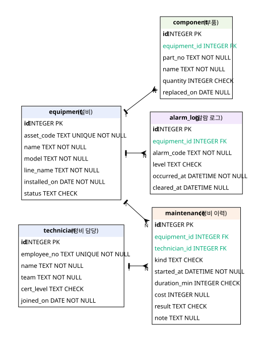

# B6-1 정보를 깔끔하게 정리하는 디지털 서랍장 만들기

코딧세이 AI 올인원 본과정 B6-1 미션 저장소입니다.

## 소재
스마트팩토리·로봇을 소재로 삼는다. 설비 카탈로그와 정비 이력을 담는 서랍장을 만든다. 설비·부품·정비 기록의 관계를 다룬다.
미션 요구사항과 제약은 원문을 그대로 따르고, 소재는 데이터·예시·문구 범위에서만 바꾼다.

## 범위
SQL 실습·테이블 4개+·1:N 관계 2개+·CREATE/INSERT 스크립트·쿼리 15개·인덱스

## 개발 환경
로컬 DB와 SQL 실행 도구를 사용하는 실습입니다. 최소 준비안은 SQLite와 sqlite3 CLI이며, 착수 시 사용할 DB를 확정합니다.
백엔드 프레임워크는 사용하지 않습니다.

### 새 환경에서 준비

Git을 설치한 뒤 새 기기에서 저장소를 받습니다.

```bash
git clone https://github.com/sarguments/b6-1-sql-drawer.git
cd b6-1-sql-drawer
```

SQLite 명령줄 도구를 설치한 뒤, 저장소 루트에서 메모리 데이터베이스 연결을 확인합니다.

```bash
sqlite3 --version
sqlite3 :memory: "SELECT sqlite_version();"
```

## 파일 구성

| 파일 | 내용 |
| --- | --- |
| [`schema.sql`](schema.sql) | 테이블 5개 생성(`CREATE TABLE`) — PK·FK·제약조건·타입 주석 |
| [`seed.sql`](seed.sql) | 샘플 데이터 입력(`INSERT`) — 테이블당 10행 이상 |
| [`queries.sql`](queries.sql) | 핵심 쿼리 15개 + 각 쿼리 한 줄 설명 + 인덱스 |
| [`results/`](results) | 쿼리별 실행 결과 텍스트(`Q01`~`Q15`)·요약·보너스 3건 |
| [`erd.svg`](erd.svg) · [`erd.dot`](erd.dot) | 테이블 관계도(ERD) 이미지와 생성 원본 |
| [`scripts/capture_results.py`](scripts/capture_results.py) | 스키마·샘플 데이터를 새로 채우고 결과를 다시 만드는 스크립트 |

## 실행 방법

결과를 다시 만들려면 스키마·샘플 데이터부터 새 데이터베이스에 채워야 합니다. `queries.sql` 뒤쪽에 값을 바꾸는 `UPDATE`·`DELETE`가 있어서, 이미 바뀐 데이터에 다시 실행하면 결과가 달라지기 때문입니다.

```bash
python3 scripts/capture_results.py      # 결과 일괄 재생성 (권장)
```

손으로 한 단계씩 확인하려면 같은 일을 이렇게 합니다.

```bash
rm -f b6-1.sqlite3
sqlite3 b6-1.sqlite3 < schema.sql
sqlite3 b6-1.sqlite3 < seed.sql
sqlite3 b6-1.sqlite3 < queries.sql
```

`queries.sql`은 표준 SQL 범위로 썼습니다. SQLite 고유 문법을 쓴 곳은 두 군데뿐이고, 해당 위치에 주석으로 표시했습니다.

- `schema.sql`의 `AUTOINCREMENT`(자동 증가 키), `PRAGMA foreign_keys = ON`(외래 키 검사 켜기)
- `queries.sql` Q15의 `EXPLAIN QUERY PLAN`(실행 계획 출력)

## 데이터 설계

- 테이블 5개: `equipment`(설비), `technician`(정비 담당), `component`(부품), `maintenance`(정비 이력), `alarm_log`(알람 로그).
- 1:N 관계 4개: 설비→부품, 설비→정비 이력, 담당자→정비 이력, 설비→알람 로그.
- 제약조건: `asset_code`·`employee_no`에 `UNIQUE`, 주요 컬럼에 `NOT NULL`, `status`·`cert_level`·`kind`·`result`에 `CHECK`(정해진 값만 저장), 부품 수량 `CHECK (quantity > 0)`.
- 타입: 날짜만 필요하면 `DATE`, 시각까지 필요하면 `DATETIME`, 값·식별자는 `TEXT`, 개수·시간은 `INTEGER`. 근거는 각 컬럼 옆 주석에 적었다.
- 외래 키: `schema.sql` 첫 줄의 `PRAGMA foreign_keys = ON`이 있어야 실제로 막힌다(SQLite 기본값은 꺼짐). 확인 결과는 `results/bonus2-fk-violation.txt`에 있다.
- 인덱스 1개: `idx_maintenance_equipment_started` — `maintenance (equipment_id, started_at)`. 설비 하나의 기간별 정비 이력 조회가 가장 잦아, 설비로 먼저 좁히고 그 안에서 기간을 자르게 했다. 이유와 전후 실행 계획은 `queries.sql`의 Q15에 있다.

## 엑셀·파일 대신 데이터베이스를 쓴 이유

같은 표를 엑셀 파일로도 만들 수 있다. 그래도 여기서는 테이블로 나눠 저장했고, 그 차이는 아래 지점에서 드러난다.

- **관계를 값으로 잇는다**: 엑셀에서 정비 이력에 설비 이름을 적으면 이름이 바뀔 때 그 시트를 전부 고쳐야 한다. 여기서는 `maintenance`가 설비의 `id`만 갖고(`equipment_id`) 이름은 `equipment` 한 행에만 있다. 이름을 한 번 고치면 연결된 조회가 모두 새 이름으로 나온다.
- **무결성을 저장 시점에 막는다**: 엑셀은 없는 설비 번호를 적어도 아무 일도 일어나지 않는다. 여기서는 `PRAGMA foreign_keys = ON`이 켜져 있어 없는 부모를 가리키는 입력이 거부된다(`results/bonus2-fk-violation.txt`).
- **규칙을 스키마가 강제한다**: `NOT NULL`·`UNIQUE`·`CHECK`로 값의 누락·중복·범위를 저장 단계에서 막는다(`asset_code` 중복 불가, `status`는 정해진 값만). 엑셀의 유효성 검사는 셀 단위 수식이라 복사·붙여넣기로 우회된다.
- **여러 사람이 동시에 다룰 수 있다**: 공유 파일은 두 사람이 열면 나중에 저장한 쪽이 앞선 저장을 덮는다. 데이터베이스는 여러 연결이 동시에 읽고 쓰고, 트랜잭션으로 일부만 반영되는 상태를 막는다.
- **필요한 열만 골라 한 번에 뽑는다**: 조인·집계로 원하는 조합을 쿼리 하나로 얻는다(Q05~Q11). 엑셀의 VLOOKUP·피벗도 비슷한 일을 하지만, 데이터가 늘면 시트 전체를 다시 계산해야 한다.

이번 실습에서 그 차이가 실제로 드러나는 곳은 테이블 5개와 1:N 관계 4개(`schema.sql`), FK 위반 차단(`results/bonus2-fk-violation.txt`), `UNIQUE`·`CHECK` 제약, 조인·집계 쿼리(Q05~Q11)다.

## 쿼리 15개

쿼리 본문은 [`queries.sql`](queries.sql)에, 각 쿼리의 실행 결과는 `results/`의 같은 이름 파일에 있다. 아래 표의 `Qxx`가 결과 파일 링크다.

| 번호 | 범주 | 무엇을 확인하는가 |
| --- | --- | --- |
| [Q01](results/Q01.txt) | 기본 조회 | 가동 중 설비 목록 (`WHERE` + `ORDER BY`) |
| [Q02](results/Q02.txt) | 기본 조회 | 최근 정비 5건 (`ORDER BY` + `LIMIT`) |
| [Q03](results/Q03.txt) | 기본 조회 | 고장 정비 이력만 (`WHERE` 값 비교) |
| [Q04](results/Q04.txt) | 기본 조회 | 2026-09-01 이후 설치 설비 (`DATE` 범위 비교) |
| [Q05](results/Q05.txt) | 조인 | 정비 이력 + 설비 + 담당자 (`INNER JOIN` 2개) |
| [Q06](results/Q06.txt) | 조인 | 설비별 부품 목록 (`INNER JOIN`) |
| [Q07](results/Q07.txt) | 조인 | 설비별 정비 건수 (`LEFT JOIN` + `COUNT`) |
| [Q08](results/Q08.txt) | 조인 | 설비별 알람 (`LEFT JOIN`) |
| [Q09](results/Q09.txt) | 집계 | 담당자별 총 정비 시간 (`SUM` + `GROUP BY`) |
| [Q10](results/Q10.txt) | 집계 | 정비 2건 이상 설비의 평균·최대 시간 (`AVG` + `GROUP BY` + `HAVING`) |
| [Q11](results/Q11.txt) | 집계 | 라인별 알람 건수 (`COUNT` + `GROUP BY`) |
| [Q12](results/Q12.txt) | 서브쿼리 | 정비 이력이 없는 설비 찾기 (`NOT EXISTS`) |
| [Q13](results/Q13.txt) | 수정 | 정비 완료 설비를 가동 상태로 되돌리기 (`UPDATE`) |
| [Q14](results/Q14.txt) | 삭제 | 처리 완료된 오래된 `WARN` 알람 지우기 (`DELETE`) |
| [Q15](results/Q15.txt) | 인덱스 | 정비 이력 조회 인덱스 생성 + 적용 이유 |

범주 분포는 기본 조회 4, 조인 4(`INNER` 2·`LEFT` 2), 집계 3(`COUNT`·`SUM`·`AVG`), 서브쿼리 1, 수정·삭제 2, 인덱스 1이다. 아래는 일부 쿼리의 본문과 결과다.

### Q07 — 설비별 정비 건수 (`LEFT JOIN`)

`maintenance`에 이력이 없는 설비도 `LEFT JOIN`이라 0건으로 남는다. `EQ-AG-001`(이동 로봇 1호)이 그 예다.

```sql
SELECT e.asset_code, e.name AS equipment_name, COUNT(m.id) AS maintenance_count
FROM equipment AS e
LEFT JOIN maintenance AS m ON m.equipment_id = e.id
GROUP BY e.id, e.asset_code, e.name
ORDER BY maintenance_count DESC, e.asset_code;
```

```text
asset_code | equipment_name | maintenance_count
-----------+----------------+------------------
EQ-CV-001  | 컨베이어 1호        | 4
EQ-CB-001  | 협동로봇 셀 1호      | 3
...
EQ-WD-002  | 용접 로봇 2호       | 1
EQ-AG-001  | 이동 로봇 1호       | 0
(12행)
```

### Q12 — 정비 이력이 없는 설비 (`NOT EXISTS`)

Q07의 `0`건 설비를 조건으로 직접 고른 형태다. 서브쿼리로 이력 유무만 확인한다.

```sql
SELECT e.asset_code, e.name AS equipment_name, e.installed_on, e.status
FROM equipment AS e
WHERE NOT EXISTS (
    SELECT 1 FROM maintenance AS m WHERE m.equipment_id = e.id
)
ORDER BY e.asset_code;
```

```text
asset_code | equipment_name | installed_on | status
-----------+----------------+--------------+-------
EQ-AG-001  | 이동 로봇 1호       | 2026-09-20   | IDLE
(1행)
```

### Q10 — 정비 2건 이상 설비의 평균·최대 시간 (`AVG` + `HAVING`)

`GROUP BY`로 설비별로 묶고, `HAVING COUNT(m.id) >= 2`로 2건 이상만 남겨 평균 소요 시간 순으로 본다.

```text
asset_code | equipment_name | maintenance_count | avg_minutes | max_minutes
-----------+----------------+-------------------+-------------+------------
EQ-CB-002  | 협동로봇 셀 2호      | 2                 | 115.0       | 180
EQ-WD-001  | 용접 로봇 1호       | 3                 | 111.7       | 200
...
EQ-CV-002  | 컨베이어 2호        | 2                 | 50.0        | 65
(10행)
```

### Q15 — 인덱스 적용 전후 실행 계획

`maintenance (equipment_id, started_at)`에 인덱스를 만든 뒤 같은 조회를 다시 계획해 본다. 전체 훑기(`SCAN`)가 인덱스 탐색(`SEARCH ... USING INDEX`)으로 바뀐다.

```text
-- 생성 전
SCAN maintenance
-- 생성 후
SEARCH maintenance USING INDEX idx_maintenance_equipment_started
```

### Q13·Q14 — 값 변경과 삭제

`UPDATE`(Q13)는 정비가 끝난 `MAINTENANCE` 설비를 `RUNNING`으로 되돌리고, `DELETE`(Q14)는 처리 완료된 오래된 `WARN` 알람을 지운다. 값을 바꾸는 쿼리가 뒤에 있어, 같은 파일을 다시 실행하면 결과가 달라진다. 그래서 결과 재생성은 스키마·샘플 데이터부터 새로 채운다.

## 보너스

세 과제를 모두 [`scripts/capture_results.py`](scripts/capture_results.py)에서 재현하고 결과를 남겼다.

- [보너스 1 — 같은 요구를 `JOIN`과 서브쿼리 두 방식으로](results/bonus1-join-vs-subquery.txt): "정비 이력이 있는 설비"를 `INNER JOIN`과 `EXISTS`로 각각 뽑아 결과가 같음을 확인하고, 언제 어느 쪽을 쓰는지 비교했다.
- [보너스 2 — 데이터 정합성 깨뜨려 보기](results/bonus2-fk-violation.txt): 없는 부모 값(`equipment_id = 999`)을 넣어 `FOREIGN KEY constraint failed`로 막히는 것과 고치는 방법을 기록했다.
- [보너스 3 — 핵심 지표 미니 리포트](results/bonus3-mini-report.txt): 이 DB로 뽑는 핵심 지표 3개(설비별 총 정비 시간 상위, 라인별 고장 정비 건수, 정비 담당자별 평균 처리 시간)와 각 지표 SQL을 정리했다.

## 테이블 관계 (ERD)



- `equipment`(설비) 1 : N `component`(부품)
- `equipment`(설비) 1 : N `maintenance`(정비 이력)
- `technician`(정비 담당) 1 : N `maintenance`(정비 이력)
- `equipment`(설비) 1 : N `alarm_log`(알람 로그)

`erd.dot`이 Graphviz 원본이고, `erd.svg`는 그로부터 만든 이미지다.
